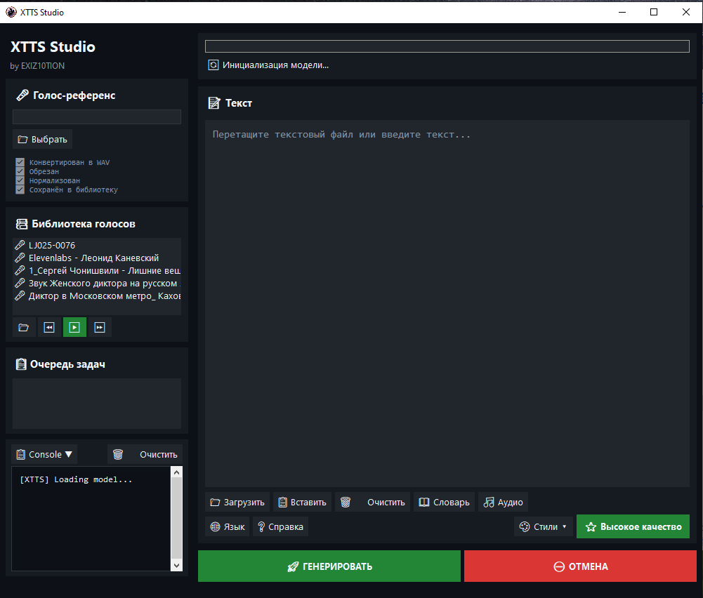
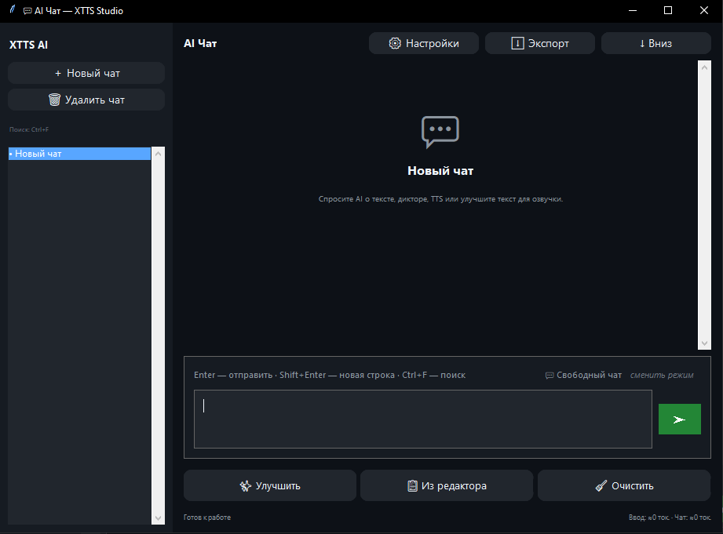
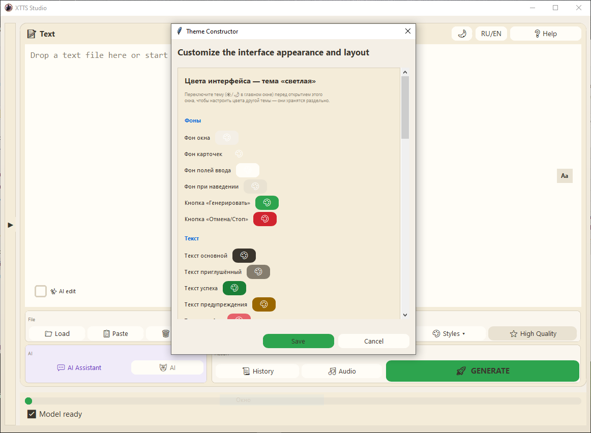
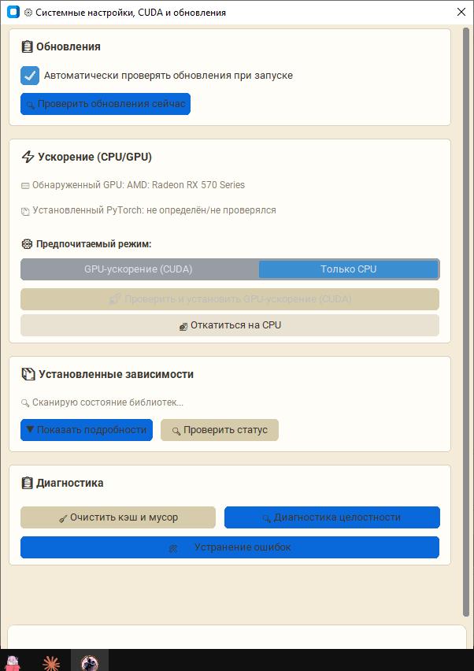

<div align="center">

# 🎙️ XTTS Studio

**Портативное офлайн-приложение для клонирования голоса и синтеза речи на базе XTTS v2**

[]()
[]()
[]()
[]()
[]()

</div>

---

## 🚀 О проекте

**XTTS Studio** — полностью офлайн инструмент для синтеза речи и клонирования голоса.
Работает в портативном режиме, не требует установки и не использует интернет.
AI-модуль опционален — подключается через любой OpenAI-совместимый провайдер.

---

## 📥 Скачать

> ⚠️ Google Drive может показать предупреждение о большом размере файла перед скачиванием — это нормально: файл не проверяется антивирусом Google из-за размера, а не из-за угрозы.

| Версия | Размер | Ссылка |
|---|---|---|
| ⚙️ CPU-only | 5 ГБ | [📥 Download XTTS Studio (Google Drive)](https://drive.google.com/file/d/1RJfaMjVHV_NUaaHgg4uSd0B8DI9noxRs/view?usp=drive_link) |
| 🚀 NVIDIA CUDA | 10 ГБ | [📥 Download XTTS Studio (GitHub Releases)](https://github.com/DreamSketcher/XTTS-Studio-portable-/releases) |

📜 **Лицензия:** [LICENSE.md](./LICENSE.md) — свободное использование с обязательным указанием автора

---

## ✨ Возможности

### 🎤 Синтез и клонирование
- Полностью офлайн — никаких внешних запросов
- Portable — одна папка, любой Windows ПК
- Клонирование голоса по референсу 10–20 секунд
- Библиотека голосов с кэшем Speaker Embedding
- Поддержка длинных текстов без ограничений
- Авто-переключение языка RU/EN внутри одного текста

### 🖥 Интерфейс
- 🌗 **Две темы:** тёмная и мягкая светлая («молочная») — переключение одной кнопкой
- 🌐 **Два языка интерфейса:** русский и английский (RU/EN), включая AI-чат и настройки провайдеров
- 📐 Адаптивный тулбар — панели растягиваются под размер окна
- ◀ Выдвижная левая панель с запоминанием положения
- 🔠 Регулируемый размер текста в окне ввода (ползунок «Aa»)
- Все настройки вида сохраняются между сессиями

### 🧠 Обработка текста
- Числа → слова автоматически
- Аббревиатуры → фонетический словарь (авто + ручной)
- Смысловые и пунктуационные паузы — автоматически
- Нормализация текста перед генерацией

### 🎛 Управление качеством
- 4 пресета: ⭐ Высокое качество / 📖 Нарратив / ⚡ Динамика / 🎭 Экспрессия
- Тонкая настройка: temperature, top_p, repetition_penalty, скорость, trim
- Контроль качества чанков — авто-перегенерация при повторах и обрывах
- Де-эссер, RMS-нормализация громкости, авто-обрезка тишины
- Кэш чанков — повторная генерация того же текста не тратит время

### 🤖 AI-модуль (опционально)
- **AI Conductor** — анализирует текст и назначает параметры XTTS для каждого чанка индивидуально
  - Уровень 1: temperature, speed, паузы по контексту и интонации
  - Уровень 2: rewrite текста под заданный жанр или настроение (с negative prompt)
  - Оба уровня работают независимо и комбинируются
- **AI чат** — встроенный чат-ассистент с историей сессий и поиском
  - Режим редактора текста и режим свободного чата
  - Кнопка «Улучшить» — технический rewrite текста для лучшего TTS
- Поддержка цепочки провайдеров: Groq, OpenRouter, кастомные OpenAI-совместимые
- Каталог провайдеров, библиотека ключей

### 📋 Прочее
- Очередь задач с отменой
- Пакетная обработка TXT-файлов
- История генераций с возвратом текста
- Подсветка текущего чанка в реальном времени
- Статистика: время, чанки, голос, скорость
- Автосохранение настроек между сессиями
- Экспорт в WAV и MP3

---

## 🖼 Скриншоты

<p align="center">
  
  
</p>
<p align="center">
  
  
</p>

---

## 🚀 Быстрый старт

1. Скачайте и распакуйте архив
2. Не используйте путь с кириллицей
3. Запустите `XTTS Studio.exe`
4. Выберите или загрузите голосовой референс
5. Введите текст
6. Нажмите **🚀 ГЕНЕРИРОВАТЬ**
7. Результат сохраняется в `outputs/` — кнопка **🎵 Аудио**

---

## ⚙️ Как работает

```
Референс → авто-обработка → библиотека голосов
   ↓
Текст → нормализация → числа в слова → аббревиатуры
   ↓
(опционально) AI-улучшение / rewrite текста
   ↓
Разбивка на чанки → простановка пауз
   ↓
(опционально) AI Conductor — параметры для каждого чанка
   ↓
Генерация с контролем качества и кэшированием
   ↓
Сборка → нормализация громкости → де-эссер → WAV / MP3
```

---

## 🧠 Словарь произношений

Примеры встроенных правил:

```
AI      → эй ай
CPU     → си-пи-ю
GPU     → джи-пи-ю
OpenAI  → ОпенЭйАй
```

Словарь пополняется автоматически при генерации и через AI Conductor.
Редактирование — кнопка **📖 Словарь** (добавление, изменение, удаление правил).

---

## 💻 Требования

| | CPU-версия | CUDA-версия |
|---|---|---|
| ОС | Windows 10/11 x64 | Windows 10/11 x64 |
| Память | 8+ ГБ RAM | 8+ ГБ RAM |
| GPU | — | NVIDIA, 4+ ГБ VRAM, Compute Capability 6.0+ |
| Скорость | медленнее реального времени | быстрее реального времени |

---

## ⚠️ Важно

Не используйте пути с кириллицей:

```
✔ C:\XTTS\
✘ C:\Новая папка\XTTS\
```

---

# 🗂 Полная структура проекта

**Точка входа:** `XTTS Studio.exe` → BAT → `python\runtime\python.exe` → `gui.py` → зависимости из `python\xtts_env`

Проект имеет модульную архитектуру: тонкая точка входа, техническое ядро `engine/` (без GUI-зависимостей) и слой интерфейса `engine/gui/`.

## Дерево проекта

```
XTTS Studio (portable)
│
├── gui.py                        ← точка входа: только запуск интерфейса
├── i18n.py                       ← локализация интерфейса (RU / EN)
├── settings.json                 ← настройки сессии: пресеты, тема, язык, панель (авто)
├── gpt_settings.json             ← провайдер AI, ключи, модели (авто)
├── word_rules.json               ← словарь произношений (авто + ai_corrected)
├── chat_history.json             ← история AI чат-сессий
├── history.json                  ← история генераций
│
├── engine/                       ═══ ТЕХНИЧЕСКОЕ ЯДРО (без tkinter) ═══
│   │
│   │   ── пайплайн генерации ──
│   ├── tts_runner.py             ← главный пайплайн: normalize → chunk → generate → merge
│   ├── chunker.py                ← разбивка текста на чанки
│   ├── normalizer.py             ← числа→слова, аббревиатуры, пунктуация
│   ├── word_replacer.py          ← фонетические замены по словарю
│   ├── text_utils.py             ← общие текстовые хелперы
│   ├── smart_pauses.py           ← паузы между чанками (без кондуктора)
│   ├── prosody_layer.py          ← смысловая просодия (без кондуктора)
│   ├── de_esser.py               ← подавление шипящих
│   │
│   │   ── AI-модуль ──
│   ├── ai_conductor.py           ← AI Conductor (параметры чанков + rewrite)
│   ├── gpt_client.py             ← AI-клиент: провайдеры, ключи, fallback-цепочка
│   │
│   │   ── голос и аудио ──
│   ├── reference_processor.py    ← конвертация и нормализация референса
│   ├── voice_manager.py          ← библиотека голосов
│   ├── audio_backend.py          ← инициализация аудио (pygame)
│   │
│   │   ── инфраструктура ──
│   ├── task_manager.py           ← многопоточная очередь задач
│   ├── task_models.py            ← модель задачи Task
│   ├── task_queue.py             ← thread-safe очередь
│   ├── updater.py                ← авто-обновление (check/apply/restart)
│   ├── paths.py                  ← базовые директории проекта
│   ├── settings_store.py         ← чтение settings.json
│   ├── history_store.py          ← хранилище истории генераций
│   ├── output_naming.py          ← именование выходных файлов
│   ├── text_tools.py             ← нормализация текста для GUI
│   └── logging_utils.py          ← файловое логирование
│
│   └── gui/                      ═══ ИНТЕРФЕЙС (tkinter / customtkinter) ═══
│       │
│       │   ── ядро окна ──
│       ├── main_window.py        ← сборка главного окна (оркестратор)
│       ├── layout.py             ← раскладка + выдвижная левая панель
│       ├── theme.py              ← темы (тёмная / светлая), titlebar
│       ├── colors.py             ← палитры обеих тем
│       ├── widgets.py            ← фабрики виджетов, CTk-совместимость
│       ├── tooltip.py            ← всплывающие подсказки
│       ├── gradient.py           ← градиентный фон
│       │
│       │   ── панели главного окна ──
│       ├── header_panel.py       ← шапка: Обновить / AI статус / RU-EN
│       ├── voice_panel.py        ← референс + библиотека голосов
│       ├── player.py             ← плеер референса
│       ├── queue_panel.py        ← очередь задач
│       ├── console.py            ← встроенная консоль
│       ├── textbox.py            ← окно ввода: DnD, подсветка чанков, размер текста
│       ├── toolbar.py            ← адаптивный тулбар: Файл / AI / Вывод / Действие
│       ├── statusbar.py          ← прогресс-бар и статус
│       │
│       │   ── логика GUI ──
│       ├── generation.py         ← запуск/отмена генерации, callbacks
│       ├── presets.py            ← пресеты качества + окно настроек
│       ├── settings_ui.py        ← сохранение и применение настроек
│       ├── styles_menu.py        ← меню «Стили»
│       ├── updates.py            ← проверка обновлений (GUI-обвязка)
│       │
│       │   ── отдельные окна ──
│       ├── chat_window.py        ← AI чат (сессии, поиск, экспорт, настройки AI)
│       ├── ai_conductor.py       ← окно AI Conductor
│       ├── ai_status_window.py   ← окно «AI статус»
│       ├── history_window.py     ← окно «История»
│       ├── output_window.py      ← окно «Аудио» со встроенным плеером
│       ├── batch_window.py       ← пакетная обработка TXT
│       ├── word_replacer_window.py ← словарь произношений
│       └── dialogs.py            ← язык озвучки, справка
│
├── models/xtts_v2/               ← модель (офлайн)
├── library/[voice_name]/         ← голосовые профили + кэш embedding (CPU/CUDA)
├── outputs/_cache/               ← готовые файлы + кэш чанков (md5)
├── logs/                         ← логи ошибок
├── reference/                    ← исходные референс-файлы
├── ffmpeg/bin/                   ← ffmpeg.exe, ffprobe.exe
└── python/
    ├── xtts_env/                 ← venv с зависимостями
    └── runtime/                  ← Python 3.11 portable
```

---

## 🔬 Модули engine/ — по зонам ответственности

### Пайплайн генерации
- **`tts_runner.py`** — `run_tts()`: normalize → word replacer → chunk → conductor → generate → merge. Ленивая загрузка модели (`get_tts()`, thread-safe singleton), автодетект CUDA/CPU, кэш embedding и готовых чанков (md5), QC (детектор зацикливания + валидатор длительности), авто-trim по тишине, RMS-нормализация громкости.
- **`chunker.py`** — разбивка на предложения, нарезка длинных, объединение коротких, проверка плохого начала/конца чанка.
- **`normalizer.py`** — числа→слова, аббревиатуры, пунктуация; отдельно ритм для латинских/кириллических аббревиатур и CamelCase.
- **`word_replacer.py`** — фонетические замены по словарю, автотранслитерация аббревиатур и терминов.
- **`smart_pauses.py` / `prosody_layer.py`** — паузы и смысловая просодия; **оба пропускаются, если активен AI Conductor** — тогда паузы и temperature schedule берутся из `conductor_map`.

### AI-модуль
- **`ai_conductor.py`** — `conduct()`: один вызов на весь текст, анализирует чанки и возвращает параметры озвучки (temperature/top_p/repetition_penalty/speed/pause_after_ms) для каждого. Опционально — переработка текста под стиль (`rewrite_enabled`) и проверка транслита (`corrections` → `word_rules.json`). При ошибке ИИ — фолбэк на дефолтные параметры, генерация не прерывается.
- **`gui/chat_window.py`** — окно чата с двумя режимами (редактор текста / свободный чат), кнопка «Улучшить» для технического rewrite перед TTS. Полностью локализовано (RU/EN).
- **`gpt_client.py`** — цепочка провайдеров (активный → встроенные → кастомные), управление ключами и моделями, каталог провайдеров, локализованные подписи.

### Голос и аудио
- **`reference_processor.py`** — конвертация референса в WAV, SNR-проверка, кэш.
- **`voice_manager.py`** — сканирование `library/`, список голосов, активный голос.
- **`de_esser.py`** — подавление шипящих на финальном файле.

### Инфраструктура
- **`task_manager.py` / `task_queue.py` / `task_models.py`** — многопоточная очередь генерации с отменой по id.
- **`updater.py`** — проверка/применение обновлений, самоперезапуск.
- **`i18n.py`** — словарь переводов RU/EN (350+ ключей), автозагрузка сохранённого языка.

---

## 🎚 Как устроен AI Conductor (важно для отладки)

Два независимых уровня, каждый со своим флагом:

| Уровень | Флаг | Что делает |
|---|---|---|
| 1 — параметры | `ai_conductor_enabled` | temperature/top_p/repetition_penalty/speed/pause для каждого чанка |
| 2 — rewrite | `ai_rewrite_enabled` | переработка текста под стиль/жанр (только если уровень 1 включён) |

Уровень 2 применяется **только** при явном `rewrite_enabled=True` — эта проверка задублирована в двух местах (`ai_conductor.py: conduct()` и `tts_runner.py: run_tts()`), чтобы модель или будущие правки не могли случайно протащить rewrite текста при выключенном флаге уровня 2.

---

## 🗃 Данные и конфиги

| Файл | Назначение |
|---|---|
| `settings.json` | сессия: пресеты, флаги, тема, язык UI, положение панели, размер текста |
| `gpt_settings.json` | провайдер AI, ключи, модели |
| `word_rules.json` | словарь произношений (ручные + `ai_corrected` от кондуктора) |
| `chat_history.json` | история AI чат-сессий |
| `history.json` | история генераций |

---

## 🧩 Разработка

Приложение разработано с использованием AI-инструментов: **Claude**, **ChatGPT** и других.

Рефакторинг архитектуры (разделение на `engine/` + `engine/gui/`), локализация RU/EN, светлая тема и доработки интерфейса выполнены с помощью **Arena.ai Agent Mode** (мульти-модельный агент: Claude, ChatGPT, Gemini и др.).

---

## ⚖️ Сторонние компоненты

Проект использует модель **XTTS v2** (Coqui), распространяемую под лицензией [Coqui Public Model License (CPML)](https://coqui.ai/cpml). Использование модели регулируется условиями CPML независимо от лицензии данного проекта.

---

## ☕ Поддержка проекта

**BTC:** `bc1qz78u3lvagt3v886359glv57ct6rnlh506wjmdy`

---

<div align="center">

**XTTS Studio** · by EXIZ10TION · Made with 🎙️ and ❤️

</div>
